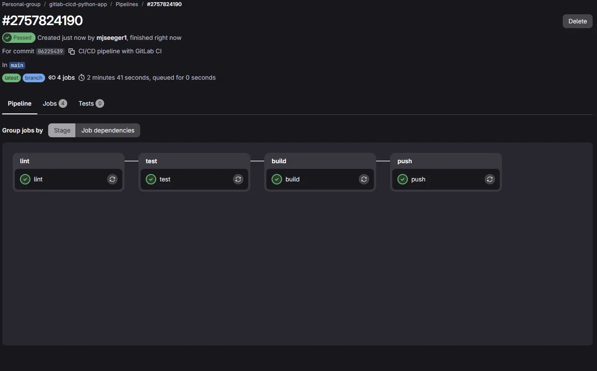
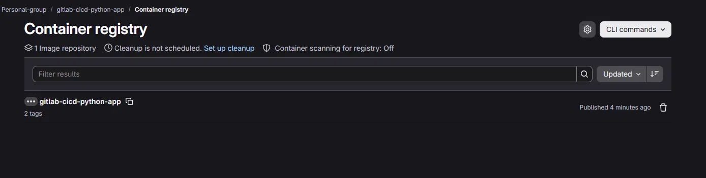

# CI/CD Pipeline with GitLab CI — Python Flask API

> **Live pipeline:** https://gitlab.com/Personal-group/gitlab-cicd-python-app
> The repository is mirrored to GitHub, but the pipeline runs on GitLab CI.

A small Flask API used as a hands-on portfolio project to demonstrate a **complete CI/CD pipeline with GitLab CI**: linting, automated testing, Docker image build, and publishing to the GitLab Container Registry.

## What this demonstrates

- A multi-stage GitLab CI pipeline (`lint → test → build → push`)
- Automated testing with `pytest` on every push
- Code style checks with `flake8`
- Docker image build using Docker-in-Docker (`dind`)
- Publishing versioned + `latest` images to the GitLab Container Registry
- A non-root, slim Docker image following basic container security practices

## Pipeline overview

```
push to GitLab
      │
      ▼
   ┌───────┐    ┌──────┐    ┌───────┐    ┌──────┐
   │ lint  │ →  │ test │ →  │ build │ →  │ push │
   └───────┘    └──────┘    └───────┘    └──────┘
   flake8        pytest      docker       docker push
                              build        to GitLab
                                           Container Registry
```

`build` and `push` only run on the `main` branch, so feature branches only go through lint + test.

## Pipeline in action

All four stages passing on GitLab CI:



The `push` stage publishes the image to the project's Container Registry, tagged
with both `latest` and the short commit SHA:



## Project structure

```
.
├── app/
│   └── main.py              # Flask application (3 endpoints)
├── tests/
│   └── test_main.py         # pytest unit tests
├── Dockerfile
├── .dockerignore
├── .gitlab-ci.yml           # The pipeline definition
├── requirements.txt
└── requirements-dev.txt     # Adds pytest + flake8 for CI/local dev
```

## Endpoints

| Method | Path      | Description                          |
|--------|-----------|---------------------------------------|
| GET    | `/health` | Health check, returns `{"status": "ok"}` |
| GET    | `/time`   | Current UTC time as ISO-8601          |
| GET    | `/tasks`  | Returns a small in-memory task list   |

## Running locally

```bash
python -m venv venv
source venv/bin/activate      # Windows: venv\Scripts\activate
pip install -r requirements-dev.txt

# Run the app
python -m app.main
# -> visit http://localhost:5000/health

# Run the tests
pytest -v

# Run the linter
flake8 app tests --max-line-length=100
```

## Running with Docker

```bash
docker build -t task-api .
docker run -p 5000:5000 task-api
```

## Reproducing this setup

1. Push this project to a new GitLab repository.
2. GitLab automatically provides a Container Registry per project — no extra setup needed.
3. The pipeline uses GitLab's built-in `$CI_REGISTRY_USER` / `$CI_REGISTRY_PASSWORD` / `$CI_REGISTRY` predefined variables, so **no manual secrets need to be configured** for the registry login.
4. Push to `main` — check the **CI/CD → Pipelines** tab to watch it run through all four stages.
5. Once `push` succeeds, the image is visible under **Deploy → Container Registry** in the GitLab project.

## License

MIT